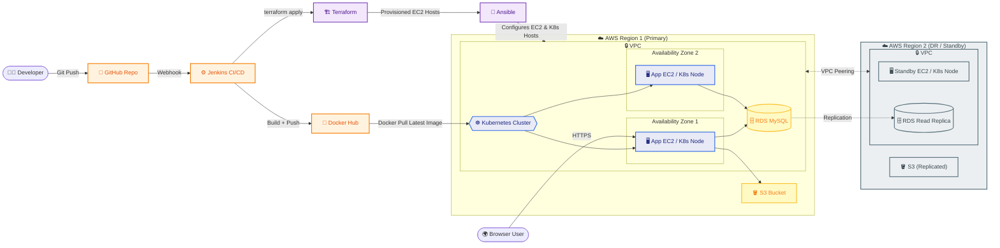

🚀 Enterprise DevOps Task Management Platform
Zero-Touch CI/CD | Multi-Region High Availability | Infrastructure as Code on AWS
> Architected and deployed a production-grade, multi-region AWS platform with fully automated CI/CD (Jenkins, Docker), Infrastructure as Code (Terraform, Ansible), and Kubernetes-orchestrated container deployment — taking every release from `git push` to production with zero manual intervention.
Project Overview
The Enterprise DevOps Task Management Platform is a cloud-native, production-ready web application built to demonstrate a complete DevOps lifecycle using modern tools and AWS cloud services. The project automates application deployment, infrastructure provisioning, monitoring, and scaling through an end-to-end CI/CD pipeline.
The application is built using Python Flask with a MySQL database (Amazon RDS in production) and is fully containerized using Docker. Source code is maintained in GitHub, while Jenkins automates the build, test, Docker image creation, and deployment process. Docker images are stored in Docker Hub.
Infrastructure is provisioned using Terraform, enabling Infrastructure as Code (IaC) for AWS resources including VPCs, subnets, EC2 instances, Amazon RDS, Application Load Balancers, IAM roles, and Amazon S3.
Application configuration and software installation are automated using Ansible, while Kubernetes manages container orchestration, rolling deployments, auto-healing, and horizontal pod autoscaling.
The platform is deployed across two AWS regions connected through VPC Peering, providing high availability and disaster recovery capabilities.
---
Architecture Diagram

---
Technology Stack
Category	Tools
Application	Python, Flask
Database	MySQL, Amazon RDS
Containerization	Docker
Orchestration	Kubernetes (Deployments, Services, HPA)
CI/CD	Jenkins
Infrastructure as Code	Terraform
Configuration Management	Ansible
Cloud Provider	AWS (EC2, RDS, S3, VPC, ALB, IAM)
Networking	VPC Peering (multi-region), Public/Private Subnets
Version Control	Git, GitHub
---
Key Features
✅ Infrastructure as Code — full AWS environment provisioned via Terraform
✅ CI/CD Pipeline — automated build, test, and deploy with Jenkins
✅ Containerization — Dockerized Flask application, images pushed to Docker Hub
✅ Configuration Management — automated server setup and app config via Ansible
✅ Container Orchestration — Kubernetes-managed deployments with rolling updates, auto-healing, and horizontal pod autoscaling
✅ High Availability — multi-region AWS deployment connected via VPC Peering
✅ Secure Networking — public/private subnet separation with dedicated security groups
✅ Managed Database — Amazon RDS (MySQL) in a private subnet
✅ Static Asset Storage — Amazon S3
---
How It Works
A developer pushes code to the GitHub repository.
A webhook triggers the Jenkins pipeline.
Jenkins checks out the code, runs tests, and builds a Docker image.
The image is pushed to Docker Hub.
Jenkins deploys the latest image to the Application EC2 instance inside AWS.
The Flask app connects to Amazon RDS for data and Amazon S3 for static assets.
Security Groups control traffic between the application, database, and internet.
End users access the app over HTTP through the public subnet.
---
Docker
Build the image
```bash
docker build -t prayag1/enterprise-devops-platform:tagname .
```
Push to Docker Hub
```bash
docker login
docker push prayag1/enterprise-devops-platform:tagname
```
Run the container locally
```bash
docker run -d -p 5000:5000 --name devops-platform prayag1/enterprise-devops-platform:tagname
```
> Replace `tagname` with a version tag (e.g. `v1.0`, `latest`) each time you build and push a new image. Jenkins uses this same image in the CI/CD pipeline to deploy the latest build to EC2 / Kubernetes.
---
Repository Structure
```
.
├── app/                # Flask application source code
├── terraform/          # Infrastructure as Code (AWS resources)
├── ansible/             # Configuration management playbooks
├── k8s/                 # Kubernetes manifests (Deployment, Service, HPA)
├── Jenkinsfile          # CI/CD pipeline definition
├── Dockerfile           # Container build definition
├── requirements.txt     # Python dependencies
└── README.md
```
